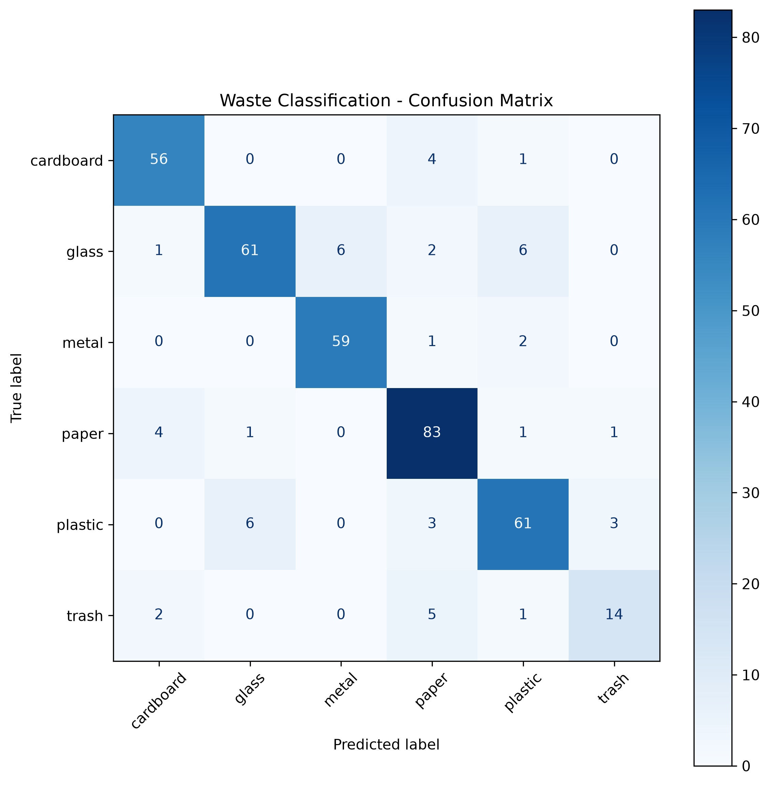

# ♻️ AI Waste Classification System

[](https://github.com/aurelianv1/ai-waste-classifier/actions/workflows/tests.yml)

An image classification application that uses deep learning to identify different types of waste and provide recycling recommendations.

The project uses **transfer learning with MobileNetV2**, trained on the TrashNet dataset, and includes a **Streamlit web interface** for real-time image classification.

## Demo

Upload an image of a waste item and the application predicts one of six categories:

- Cardboard
- Glass
- Metal
- Paper
- Plastic
- Trash

The application also displays prediction confidence, class probabilities, and a recycling recommendation when the model is sufficiently confident.

## Model Performance

The model was evaluated on an independent test set containing **384 images**.

| Metric | Score |
|---|---:|
| Test Accuracy | **86.98%** |
| Macro F1 Score | **85.07%** |
| Weighted F1 Score | **86.82%** |
| Best Validation Accuracy | **87.80%** |

### Performance by class

| Class | Precision | Recall | F1 Score |
|---|---:|---:|---:|
| Cardboard | 88.89% | 91.80% | 90.32% |
| Glass | 89.71% | 80.26% | 84.72% |
| Metal | 90.77% | 95.16% | 92.91% |
| Paper | 84.69% | 92.22% | 88.30% |
| Plastic | 84.72% | 83.56% | 84.14% |
| Trash | 77.78% | 63.64% | 70.00% |

## Confusion Matrix



The model performs particularly well on **metal, cardboard, and paper**.

The `trash` category is more challenging because it contains significantly fewer training examples than the other classes.

## Architecture

The project uses **MobileNetV2** pretrained on ImageNet.

Instead of training a convolutional neural network from scratch, transfer learning is used:

1. Load pretrained MobileNetV2 weights.
2. Freeze the convolutional feature extractor.
3. Replace the final classification layer.
4. Train the classifier for the six TrashNet categories.
5. Select the checkpoint with the highest validation accuracy.

Input images are resized to:

```text
224 × 224 pixels
```

Training data augmentation includes random horizontal flipping and random rotation.

## Dataset

The project uses the **TrashNet** dataset containing **2,527 images** across six categories.

| Class | Images |
|---|---:|
| Cardboard | 403 |
| Glass | 501 |
| Metal | 410 |
| Paper | 594 |
| Plastic | 482 |
| Trash | 137 |

The dataset is divided into:

- 70% training
- 15% validation
- 15% testing

A fixed random seed is used to make the split reproducible.

The dataset itself is not included in this repository.

## Tech Stack

- Python
- PyTorch
- Torchvision
- MobileNetV2
- Scikit-learn
- Streamlit
- Matplotlib
- Pillow
- Docker

## Project Structure

```text
ai-waste-classifier/
├── app/
│   └── app.py
├── examples/
│   └── bottle.jpg
├── models/
│   └── best_waste_classifier.pth
├── results/
│   └── confusion_matrix.png
├── src/
│   ├── dataset.py
│   ├── evaluate.py
│   ├── predict.py
│   ├── split_dataset.py
│   ├── model.py
│   └── train.py
├── .dockerignore
├── .gitignore
├── Dockerfile
├── requirements.txt
├── requirements-docker.txt
└── README.md
```

## Installation

Clone the repository:

```bash
git clone https://github.com/aurelianv1/ai-waste-classifier.git
cd ai-waste-classifier
```

Create a virtual environment:

```bash
python -m venv .venv
source .venv/bin/activate
```

Install dependencies:

```bash
pip install -r requirements.txt
```

## Run the Web Application

Start the Streamlit application:

```bash
streamlit run app/app.py
```

Then open the local Streamlit address shown in the terminal.

## Run with Docker

The application can also be run inside a Docker container using a CPU-only PyTorch environment.

Build the Docker image:

```bash
docker build -t ai-waste-classifier .
```

Run the container:

```bash
docker run --rm -p 8501:8501 ai-waste-classifier
```

Then open:

```text
http://localhost:8501
```

## Command-Line Prediction

A single image can also be classified directly from the terminal:

```bash
python src/predict.py examples/bottle.jpg
```

Example output:

```text
Prediction: plastic
Confidence: 57.09%
```

## Evaluation

Evaluate the trained model on the test dataset:

```bash
python src/evaluate.py
```

The evaluation script reports accuracy, precision, recall and F1 score and generates the confusion matrix.

## Limitations

The model was trained on the relatively small TrashNet dataset.

Real-world images can differ significantly from the training distribution in terms of backgrounds, lighting, object orientation and object type. As a result, the model may produce low-confidence or incorrect predictions for unfamiliar images.

The `trash` class is also underrepresented in the dataset, which contributes to lower recall for this category.

To reduce misleading recommendations, the web application only provides a disposal recommendation when prediction confidence is at least **50%**.

## Future Improvements

Potential improvements include:

- Fine-tuning additional MobileNetV2 layers
- Using a larger and more diverse waste dataset
- Addressing class imbalance
- Adding additional waste categories
- Deploying the Dockerized application
- Adding automated tests
- Adding a CI/CD pipeline

## Author

**Nicolae-Aurelian Anca**

Computer Science student interested in Artificial Intelligence, Machine Learning and Software Engineering.