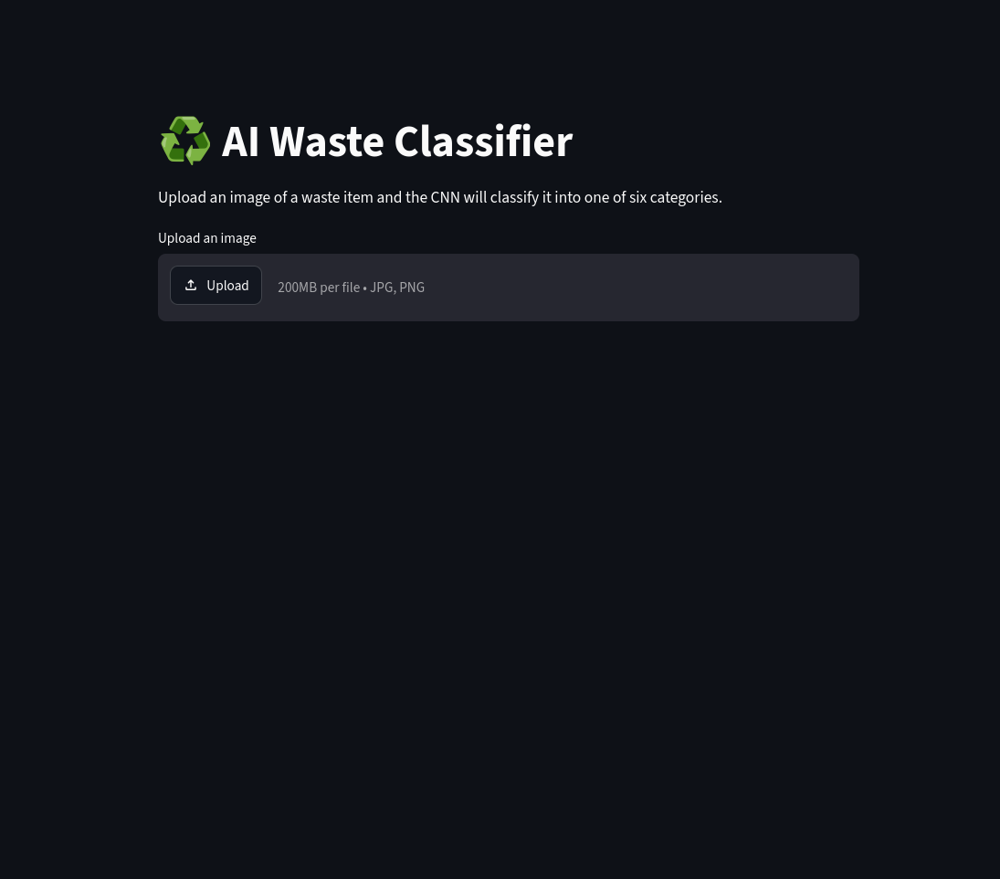

# ♻️ AI Waste Classification System

[](https://github.com/aurelianv1/ai-waste-classifier/actions/workflows/tests.yml)

An image classification application that uses deep learning to identify different types of waste and provide recycling recommendations.

The project uses **transfer learning with MobileNetV2**, trained on the TrashNet dataset, and includes a **Streamlit web interface** for real-time image classification. The application is containerized with **Docker** and covered by automated tests running in **GitHub Actions**.

## Demo

Upload an image of a waste item and the application predicts one of six categories:

- Cardboard
- Glass
- Metal
- Paper
- Plastic
- Trash

The application also displays prediction confidence, class probabilities, and a recycling recommendation when the model is sufficiently confident.




## Table of Contents

- [Model Performance](#model-performance)
- [Architecture](#architecture)
- [Dataset](#dataset)
- [Tech Stack](#tech-stack)
- [Project Structure](#project-structure)
- [Installation](#installation)
- [Run the Web Application](#run-the-web-application)
- [Run with Docker](#run-with-docker)
- [Command-Line Prediction](#command-line-prediction)
- [Training the Model](#training-the-model)
- [Evaluation](#evaluation)
- [Testing and CI](#testing-and-ci)
- [Limitations](#limitations)
- [Future Improvements](#future-improvements)
- [Author](#author)

## Model Performance

The model was evaluated on an independent test set containing **384 images**.

| Metric | Score |
|---|---:|
| Test Accuracy | **86.98%** |
| Macro F1 Score | **85.07%** |
| Weighted F1 Score | **86.82%** |
| Best Validation Accuracy | **87.80%** |

### Performance by class

| Class | Precision | Recall | F1 Score |
|---|---:|---:|---:|
| Cardboard | 88.89% | 91.80% | 90.32% |
| Glass | 89.71% | 80.26% | 84.72% |
| Metal | 90.77% | 95.16% | 92.91% |
| Paper | 84.69% | 92.22% | 88.30% |
| Plastic | 84.72% | 83.56% | 84.14% |
| Trash | 77.78% | 63.64% | 70.00% |

### Confusion Matrix


The model performs particularly well on **metal, cardboard, and paper**.

The `trash` category is more challenging because it contains significantly fewer training examples than the other classes.

## Architecture

The project uses **MobileNetV2** pretrained on ImageNet.

Instead of training a convolutional neural network from scratch, transfer learning is used:

1. Load pretrained MobileNetV2 weights.
2. Freeze the convolutional feature extractor.
3. Replace the final classification layer with a 6-class linear layer.
4. Train only the classifier for the six TrashNet categories.
5. Select the checkpoint with the highest validation accuracy.

### Training configuration

| Setting | Value |
|---|---|
| Input size | 224 × 224 pixels |
| Optimizer | Adam |
| Learning rate | 0.001 |
| Batch size | 32 |
| Epochs | 10 |
| Loss function | Cross-entropy |
| Data augmentation | Random horizontal flip, random rotation (±10°) |
| Trainable parameters | Final classification layer only |

## Dataset

The project uses the **[TrashNet](https://github.com/garythung/trashnet)** dataset containing **2,527 images** across six categories.

| Class | Images |
|---|---:|
| Cardboard | 403 |
| Glass | 501 |
| Metal | 410 |
| Paper | 594 |
| Plastic | 482 |
| Trash | 137 |

The dataset is divided per class into:

- 70% training
- 15% validation
- 15% testing

The split is performed by `src/split_dataset.py` using a fixed random seed (42).

The dataset itself is not included in this repository (see [Training the Model](#training-the-model) for setup instructions).

## Tech Stack

- Python
- PyTorch
- Torchvision
- MobileNetV2
- Scikit-learn
- Streamlit
- Matplotlib
- Pillow
- Docker
- Pytest
- GitHub Actions

## Project Structure

```text
ai-waste-classifier/
├── .github/
│   └── workflows/
│       └── tests.yml
├── app/
│   └── app.py
├── examples/
│   └── bottle.jpg
├── models/
│   └── best_waste_classifier.pth
├── results/
│   └── confusion_matrix.png
├── src/
│   ├── dataset.py
│   ├── evaluate.py
│   ├── model.py
│   ├── predict.py
│   ├── split_dataset.py
│   └── train.py
├── tests/
│   ├── test_model.py
│   └── test_prediction.py
├── .dockerignore
├── .gitignore
├── Dockerfile
├── pytest.ini
├── requirements.txt
├── requirements-docker.txt
└── README.md
```

## Installation

Clone the repository:

```bash
git clone https://github.com/aurelianv1/ai-waste-classifier.git
cd ai-waste-classifier
```

Create a virtual environment:

```bash
python -m venv .venv

# Linux / macOS
source .venv/bin/activate

# Windows (PowerShell)
.venv\Scripts\Activate.ps1
```

Install dependencies:

```bash
pip install -r requirements.txt
```

The repository includes the trained model (`models/best_waste_classifier.pth`), so you can run the application and the command-line prediction without training anything.

## Run the Web Application

Start the Streamlit application:

```bash
streamlit run app/app.py
```

Then open the local Streamlit address shown in the terminal (by default `http://localhost:8501`).

### How the app interprets predictions

| Confidence | Behavior |
|---|---|
| ≥ 70% | Green success message and disposal recommendation |
| 50% – 70% | Warning that the model is not highly confident, with disposal recommendation |
| < 50% | Error message asking for another image, no disposal recommendation |

## Run with Docker

The application can also be run inside a Docker container using a CPU-only PyTorch environment.

Build the Docker image:

```bash
docker build -t ai-waste-classifier .
```

Run the container:

```bash
docker run --rm -p 8501:8501 ai-waste-classifier
```

Then open:

```text
http://localhost:8501
```

## Command-Line Prediction

A single image can also be classified directly from the terminal (run from the repository root):

```bash
python src/predict.py examples/bottle.jpg
```

Example output:

```text
Prediction: plastic
Confidence: 57.09%
```

The script also prints the probability of every class.

## Training the Model

Training is optional, since a trained checkpoint is already included. To reproduce it, run all commands from the repository root.

**1. Download the dataset.**
Download the resized TrashNet dataset (`dataset-resized`) from the [TrashNet repository](https://github.com/garythung/trashnet) and extract it so that the class folders are located at:

```text
data/dataset-resized/
├── cardboard/
├── glass/
├── metal/
├── paper/
├── plastic/
└── trash/
```

**2. Split the dataset into train / validation / test:**

```bash
python src/split_dataset.py
```

This creates `data/split/train`, `data/split/val` and `data/split/test`.

**3. Train the model:**

```bash
python src/train.py
```

The checkpoint with the best validation accuracy is saved to `models/best_waste_classifier.pth`.

**4. Evaluate the model:**

```bash
python src/evaluate.py
```

## Evaluation

The evaluation script (`src/evaluate.py`) loads the best checkpoint and runs it on the test set. It reports accuracy, precision, recall and F1 score per class, and saves the confusion matrix to `results/confusion_matrix.png`.

## Testing and CI

Run the automated tests locally:

```bash
pytest -v
```

The tests check that:

- the model has the correct number of output classes,
- the model accepts a 224 × 224 image and returns one score per class,
- the trained checkpoint loads and produces a valid probability distribution for the example image.

The same test suite runs automatically on every push and pull request to `main` through **GitHub Actions** (see `.github/workflows/tests.yml`).

## Limitations

- The model was trained on the relatively small TrashNet dataset (2,527 images).
- Real-world images can differ significantly from the training distribution in terms of backgrounds, lighting, object orientation and object type. As a result, the model may produce low-confidence or incorrect predictions for unfamiliar images.
- The `trash` class is underrepresented in the dataset (137 images), which contributes to its lower recall. It also has only 22 test images, so its metrics are noisier than those of the other classes.
- TrashNet contains several photos of the same object, so images in the training and test sets may be visually similar. Accuracy on completely new, real-world photos may therefore be lower than the reported test accuracy.
- The model always chooses one of the six known categories, even for objects that do not belong to any of them, and softmax confidence is not a calibrated probability.
- To reduce misleading recommendations, the web application only provides a disposal recommendation when prediction confidence is at least **50%**.
- Disposal recommendations are generic. Actual recycling rules vary by country and municipality.

## Future Improvements

- Applying ImageNet input normalization and retraining
- Fine-tuning additional MobileNetV2 layers
- Addressing class imbalance (class weights or weighted sampling)
- Comparing MobileNetV2 with other architectures
- Evaluating on a separate set of real-world photos
- Using a larger and more diverse waste dataset
- Adding additional waste categories
- Deploying the Dockerized application publicly

## Author

**Nicolae-Aurelian Anca**

Computer Science student interested in Artificial Intelligence, Machine Learning and Software Engineering.